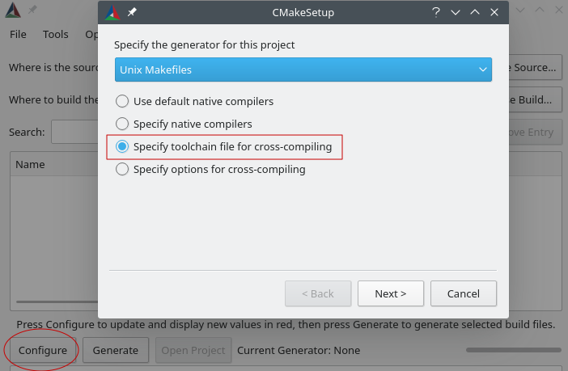
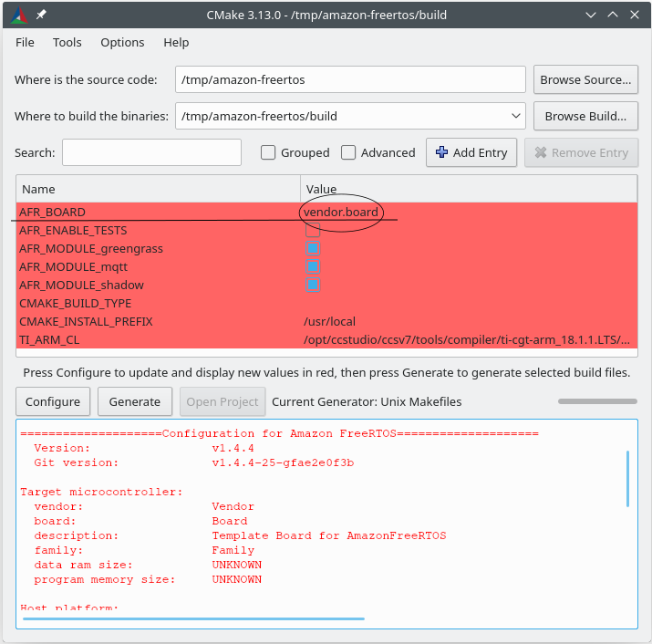

# CMake for Amazon FreeRTOS

## Prerequisites

### CMake

**CMake version 3.13 or higher is required**. You can download the binary distribution from
[CMake's official website](https://cmake.org/download/), or install with your OS package
manager. Add the CMake executable to the `PATH` environment variable if you need to use it from
command line.

### Native build system

CMake can target many native build systems. Generally you can choose either [GNU Make](
https://www.gnu.org/software/make) or [Ninja](https://github.com/ninja-build/ninja/releases). Both
of them can be installed via package managers on Linux, macOS and Windows. Ninja is preferred when
compiler is supported, it is faster than Make and also natively support all desktop OS. For using
Make on Windows, you can install a standalone version from [Equation](
http://www.equation.com/servlet/equation.cmd?fa=make), or install [MinGW](
https://sourceforge.net/projects/mingw-w64/files) which bundles make.

**Note**: The Make executable in MinGW is called `mingw32-make.exe` instead of `make.exe`.

## Getting started

Basically there are 2 steps to build any CMake based project,

1. Run CMake to generate build files for a native build system, e.g., Make or Ninja.
1. Invoke the native build system to build the project.

By default, CMake targets your host OS. To use it for cross compiling, you need to set
`CMAKE_TOOLCHAIN_FILE` before CMake reads your top level `CMakeLists.txt` file (usually from
commandline). This "toolchain file" specifies which compiler to use and set some CMake variables
like system name and default search path.

### Generate build files

To run CMake for Amazon FreeRTOS, you need to specify 2 things,

1. Target MCU, e.g., TI's CC3220SF LaunchPad.
1. Compiler to use, e.g., GCC for ARM.

CMake comes with a [command-line tool](https://cmake.org/cmake/help/latest/manual/cmake.1.html) and
an [interactive GUI tool](https://cmake.org/cmake/help/latest/manual/cmake-gui.1.html). You can use
any of them.

#### Commandline instructions

You can use `VENDOR` and `BOARD` to specify which MCU you are targeting, and `COMPILER` to tell
which compiler you want to use. For example, issue the following command from the root directory.

```sh
# `-S` and `-B` options tell CMake where our source code is and where to
# put the generated build files.
cmake -DVENDOR=ti -DBOARD=cc3220_launchpad -DCOMPILER=arm-ti -S. -Bbuild
```

**Note: On Windows, you need to add `-G"Unix Makefiles"` or `-GNinja` to the commandline because
CMake will use Visual Studio by default on Windows.**

The values of `VENDOR` and `BOARD` must match the folder names under `cmake/vendors`. And the
value of `COMPILER` must match the file names under `cmake/toolchains`, `CMAKE_TOOLCHAIN_FILE` will
be set to this file.

Note that you don't have to use full names for `VENDOR` and `BOARD`, partial names are also OK
provided there is only a single match. We use regular expression `${VENDOR}.*` and `${BOARD}.*` to
search for a matching board. For example,

```sh
cmake -DVENDOR=ti -DCOMPILER=arm-ti -S. -Bbuild
cmake -DBOARD=cc3220 -DCOMPILER=arm-ti -S. -Bbuild
cmake -DVENDOR=t -DBOARD=cc -DCOMPILER=arm-ti -S. -Bbuild
```

Additionally, if you didn't add your compiler to the PATH environment variable, CMake may not be
able to find it, you can use `AFR_TOOLCHAIN_PATH` to provide a search path in this case. We will
search the directory and its `bin` sub-folder,

```sh
cmake -DVENDOR=ti -DBOARD=cc3220 -DCOMPILER=arm-ti \
-DAFR_TOOLCHAIN_PATH=/Applications/ti/ti-cgt-arm_18.1.3.LTS -S. -Bbuild
```

You can also set `CMAKE_TOOLCHAIN_FILE` directly if you want to use a custom file from a
different location, for example,

```sh
cmake -DBOARD=cc3220 -DCMAKE_TOOLCHAIN_FILE='/path/to/toolchain_file.cmake' -S. -Bbuild
```

#### GUI instructions

Start `cmake-gui`, specify source code and output binaries locations:


Click **Configure** and choose **Specify toolchain file for cross-compiling**. Optionally, select a
build system from the **Specify the build generator for this project**
dropdown list.



Click next, then choose the toolchain file, e.g. `<AFR_ROOT>/cmake/toolchains/arm-ti.cmake`, and
click **Finish**. You will see a pop up window that says "Error in configuration process". This is
because we default to the template board, which doesn't provide any portable layer target. Now you
should see a window that looks like this:



From the dropdown box of `AFR_BOARD`, select your board and click **Configure** again. Then click
the **Generate** button. After it's finished, you should see the generated native build system files
in the output binaries directory.

### Build Amazon FreeRTOS

To build Amazon FreeRTOS, simply call the native build system command from the output binaries
directory.

```sh
cd build
make -j4
```

Alternatively, you can let CMake call the native build system for you,

```sh
cmake --build <build_dir>
```

CMake provides an abstraction layer for calling native build systems, some common usages are,

```sh
# Take advantage of CPU cores.
cmake --build <build_dir> --parallel 8
# Build specific targets.
cmake --build <build_dir> --target afr_kernel
# Clean first, then build.
cmake --build <build_dir> --clean-first
```

Check the CMake official document to see more information about the [build tool mode](
https://cmake.org/cmake/help/latest/manual/cmake.1.html#build-tool-mode).

## Porting Guide

To add CMake support for a new hardware, see the document [here](doc/porting_guide.md).
