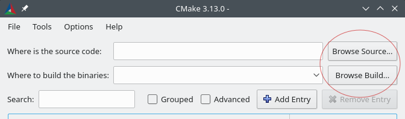

# Amazon FreeRTOS CMake porting guide

A CMake listfile is required to list a newly qualified board on the Amazon FreeRTOS console.
Use the [`CMakeLists.txt`](../vendors/vendor/board/CMakeLists.txt) template to create a new CMake
listfile file in the `<ROOT>/cmake/vendors/<vendor_name>/<board_name>` directory. **Note that you**
**need to have some basic knowledge of CMake to follow this document**.

## CMake listfile Template

The [`CMakeLists.txt`](../vendors/vendor/board/CMakeLists.txt) template file is divided into four
sections:

- [Amazon FreeRTOS Console Metadata](#amazon-freertos-console-metadata)
- [Compiler Settings](#compiler-settings)
- [Amazon FreeRTOS Portable Layers](#amazon-freertos-portable-layers)
- [Amazon FreeRTOS Demos and Tests](#amazon-freertos-demos-and-tests)

The `.cmake` files located at `<ROOT>/cmake` provide 2 functions you need to use in your CMake
listfile to define the required information for Amazon FreeRTOS:

```cmake
# This function is used to define Amazon FreeRTOS Console metadata.
afr_set_board_metadata(<name> <value>)

# This function is used to define the portable layer target associated with an
# Amazon FreeRTOS module, e.g., secure sockets or WiFi. It will create a CMake
# global INTERFACE IMPORTED target with a name AFR:<module_name>::mcu_port.
afr_mcu_port(<module_name> [<DEPENDS> [items1...]])
```

### Amazon FreeRTOS Console Metadata

The first section of the template file defines the metadata that is required to display a board's
data in the Amazon FreeRTOS console. Use the function `afr_set_board_metadata(<name> <value>)` to
define each variable listed in the template:

```cmake
afr_set_board_metadata(ID "board")
afr_set_board_metadata(DISPLAY_NAME "Board")
afr_set_board_metadata(DESCRIPTION "Template Board for AmazonFreeRTOS")
afr_set_board_metadata(VENDOR_NAME "Vendor")
afr_set_board_metadata(FAMILY_NAME "Family")
afr_set_board_metadata(DATA_RAM_MEMORY "0")
afr_set_board_metadata(PROGRAM_MEMORY "0")
afr_set_board_metadata(CODE_SIGNER "")
afr_set_board_metadata(SUPPORTED_IDE "")
afr_set_board_metadata(IDE_<IDE_ID>_NAME "")
afr_set_board_metadata(IDE_<IDE_ID>_COMPILERS "")
```

Define each variable according to the following variable descriptions:

- `ID` - ID for the board to uniquely identify it.
- `DISPLAY_NAME` - Name of the board displayed on the Amazon FreeRTOS Console.
- `DESCRIPTION` - Short description of the board on the Amazon FreeRTOS Console.
- `VENDOR_NAME`- Name of the vendor for the board.
- `FAMILY_NAME` - Family of the board.
- `DATA_RAM_MEMORY` - RAM size in suffixed with units (for example: KB).
- `PROGRAM_MEMORY` - Program memory size suffixed with units (for example: MB).
- `CODE_SIGNER` - Code signing platform used for OTA updates. Please Use
    AmazonFreeRTOS-Default for SHA256 Hash Algorithm and ECDSA encryption algorithm. For any other
    code signing please contact us.
- `SUPPORTED_IDE` - Semicolon separated IDs of IDEs supported.
- `IDE_<ID>_NAME` - Name of the IDE. Please replace <ID> with IDE ID described above.
- `IDE_<ID>_COMPILERS` - Names of compilers supported for the corresponding IDE. Please replace
    <ID> with IDE ID described above.

### Compiler Settings

The second section of the CMake file defines the compiler settings. We require you to use
`afr_mcu_port` with a special name `compiler` to create a target `AFR::compiler::mcu_port` which
holds the compiler settings information. Under the hood, the kernel will publicly link to this
INTERFACE target so that the compiler settings are transitively populated to all modules. Please
use standard CMake built-in functions to provide compiler settings. You can find an example for the
TI CC3220 Launchpad in `<ROOT>/cmake/vendors/ti/cc3220_launchpad/CMakeLists.txt`.

Here are some best practices to follow as you define the compiler settings:

- Use `target_compile_definitions` to provide compile definitions/macros.
- Use `target_compile_options` to provide compiler flags.
- Use `target_include_directories` to provide include directories.
- Use `target_link_options` to provide linker flags.
- Use `target_link_directories` to provide linker search directories.
- Use `target_link_libraries` to provide libraries to link against.

**Note:** If you have defined the compiler settings information somewhere else (for example,
if you're using CMake for your own code), then you don't need to duplicate the information in the
compiler settings section of this CMake file. Simply call `afr_mcu_port` with `DEPENDS` to bring in
the target definition from another location:

```cmake
# <your_target> is defined somewhere else, does not have to be in the same file.
afr_mcu_port(compiler DEPENDS <your_target>)
```

When you call `afr_mcu_port` with `DEPENDS`,
`target_link_libraries(AFR::compiler::mcu_port INTERFACE <your_targets>)` is called for you so that
the compiler settings are transitively populated to the required target.

If you support multiple compilers, you can use the `AFR_TOOLCHAIN` variable to dynamically select
the compiler settings. This variable is set to the name of the compiler that you are using, which
should be same as the toolchain file name found under `<ROOT>/cmake/toolchains`). For example,

```cmake
if("${AFR_TOOLCHAIN}" STREQUAL "arm-gcc")
    afr_mcu_port(compiler DEPENDS my_gcc_settings).
elseif("${AFR_TOOLCHAIN}" STREQUAL "arm-iar")
    afr_mcu_port(compiler DEPENDS my_iar_settings).
else()
    message(FATAL_ERROR "Compiler ${AFR_TOOLCHAIN} not supported.")
endif()
```

You might need more advanced control over your compiler settings to do things like set compiler
flags based on programming language, or to change settings for release and debug configurations.
You can use [CMake generator expressions](
https://cmake.org/cmake/help/latest/manual/cmake-generator-expressions.7.html).

For example,

```cmake
set(common_flags "-foo")
set(c_flags "-foo-c")
set(asm_flags "-foo-asm")
# This will only have effect on C files.
target_compile_options(
    my_compiler_settings INTERFACE
    $<$<COMPILE_LANGUAGE:C>:${common_flags} ${c_flags}>
)
# This will only have effect on ASM files.
target_compile_options(
    my_compiler_settings INTERFACE
    $<$<COMPILE_LANGUAGE:ASM>:${common_flags} ${asm_flags}>
)
```

### Amazon FreeRTOS Portable Layers

The third section of the template defines all of the portable layer targets for Amazon FreeRTOS
modules. **The only required part is to use the `afr_mcu_port(<module_name>)` function to define the
portable layer targets for the modules you're planning to implement.** You're free to use any
CMake functions as long as the target `AFR::<module_name>::mcu_port` created from `afr_mcu_port` can
provide the information we need to build the corresponding Amazon FreeRTOS module.

 The `afr_mcu_port` function creates a [GLOBAL INTERFACE IMPORTED target](
https://cmake.org/cmake/help/latest/command/add_library.html?#interface-libraries) with the name
`AFR:<module_name>::mcu_port`. `GLOBAL` allows us to reference the target in our CMake
listfiles. `INTERFACE` specifies that it should not be built as a standalone target/library, and
will be compiled into the corresponding Amazon FreeRTOS module. And `IMPORTED` allows us to create
a target name with namespace (double colon) like `AFR::kernel::port`.

All modules without corresponding portable layer targets are disabled by default. If you run the
CMake file without defining any portable layer targets, you should see the following output:

```txt
Amazon FreeRTOS modules:
  Modules to build:
  Disabled by user:
  Disabled by dependency:  kernel, posix, pkcs11, secure_sockets, mqtt, ...

  Available demos:
  Available tests:
```

As you update the `CMakeLists.txt` file with porting layer targets, corresponding Amazon FreeRTOS
module wll be enabled. You should also be able to build any Amazon FreeRTOS modules whose dependency
requirements are satisfied. For example, if MQTT is enabled, Shadow will also be enabled.

**Note:** The kernel dependency is a minimum requirement. The CMake configuration will fail if the
kernel dependency is not satisfied.

#### Kernel porting target

The kernel target depends on FreeRTOS and on your driver code. Define your driver code target first
if it needs to be compiled from source. You can define your driver code as a `STATIC` library target
or as a CMake `INTERFACE` library target:

```cmake
add_library(my_board_driver STATIC
    ${driver_sources}
)
# Use your compiler settings
target_link_libraries(
    my_board_driver
    PRIVATE ${my_compiler_settings}
# Or use the target we defined for you.
#   PRIVATE AFR::compiler::mcu_port
)
```

**Note**: `INTERFACE` library target does not have a build output, in this case your driver code
will be compiled into the kernel library.

Configure the FreeRTOS portable layer separately:

```cmake
add_library(freertos_port INTERFACE)
target_sources(
    freertos_port
    INTERFACE
        "${AFR_MODULES_DIR}/FreeRTOS/portable/GCC/ARM_CM4F/port.c"
        "${AFR_MODULES_DIR}/FreeRTOS/portable/GCC/ARM_CM4F/portmacro.h"
        "${AFR_MODULES_DIR}/FreeRTOS/portable/MemMang/heap_4.c"
)
target_include_directories(
    freertos_port
    INTERFACE
        "${AFR_MODULES_DIR}/FreeRTOS/portable/GCC/ARM_CM4F"
        "${include_path_to_FreeRTOSConfig_h}
)
```

After you have configured your driver code and the FreeRTOS portable layer, define the kernel
portable layer:

```cmake
afr_mcu_port(kernel DEPENDS my_board_driver freertos_port)

# If you need to specify additional configurations, use standard CMake functions with
# AFR::kernel::mcu_port as the target name.
target_include_directories(
    AFR::kernel::mcu_port
    INTERFACE
        "${additional_includes}" # e.g. board configuration files
)
target_link_libraries(
    AFR::kernel::mcu_port
    INTERFACE
        "${additional_dependencies}"
)
```

After the kernel portable layer is configured, you can compile the kernel as a static library. To
test the configuration, you can write a simple hello world application to consume it and make the
LED lights on your board blink. More details on how to build and test are covered in
[Build and Test Amazon FreeRTOS with CMake](build-and-test-amazon-freertos-with-cmake).

```cmake
add_executable(
    my_led_demo
    main.c
)
target_link_libraries(
    my_led_demo
    PRIVATE AFR::kernel
)
```

#### Other modules

After you add the portable layer target for the kernel, you can add the portable layer for other
Amazon FreeRTOS modules. Here's a simple example for Wi-Fi:

```cmake
afr_mcu_port(wifi)
target_sources(
    AFR::wifi::mcu_port
    INTERFACE "${AFR_MODULES_DIR}/wifi/portable/<vendor>/<board>/aws_wifi.c"
)
```

This example portable layer only has one implementation file that is based on your driver code.

**Note:** All non-kernel Amazon FreeRTOS modules implicitly depend on the kernel. Their porting
layers don't require you to explicitly specify the kernel as a dependency. POSIX, on the other
hand, is defined as an optional kernel module, you need to explicitly include it in your kernel
portable layer if you want to use it. For example:

```cmake
# By default, AFR::posix target does not expose standard POSIX headers in its public
# interface, i.e., you need to use "FreeRTOS_POSIX/pthread.h"  instead of "pthread.h".
# Link to AFR::use_posix instead if you need to use those headers directly.
target_link_libraries(
    AFR::kernel::mcu_port
    INTERFACE AFR::use_posix
)
```

Take Secure Sockets module as another example. This module depends on TLS, making the portable layer
target for this module is slightly more complicated than Wi-Fi. Amazon FreeRTOS provides a default
TLS implementation based on mbedtls:

```cmake
afr_mcu_port(secure_sockets)
target_sources(
    AFR::secure_sockets::mcu_port
    INTERFACE ${portable_layer_sources}
)
target_link_libraries(
    AFR::secure_sockets::mcu_port
    AFR::tls
)
```

You can optionally remove the `target_link_libraries()` call if your hardware is able to handle TLS
by itself.

Note that we use the standard CMake function `target_link_libraries` to state that the portable
layer depends on AFR::tls in the example above. You can reference all Amazon FreeRTOS modules by
using their target name `AFR::<module_name>`. For example, you can use the same syntax to also
depend on FreeRTOS-Plus-TCP:

```cmake
target_link_libraries(
    AFR::secure_sockets::mcu_port
    AFR::freertos_plus_tcp
    AFR::tls
)
```

### Amazon FreeRTOS Demos and Tests

This section defines the demo and test targets for Amazon FreeRTOS. All available demos and tests
are automatically enabled. You need to provide other project settings such as linker scripts
and post build commands.

```cmake
if(AFR_IS_TESTING)
    set(exe_target aws_tests)
else()
    set(exe_target aws_demos)
endif()

set(CMAKE_EXECUTABLE_SUFFIX ".elf")
add_executable(${exe_target} "${board_dir}/application_code/main.c")
```

For information about how to run post build commands, please check [add_custom_command](
https://cmake.org/cmake/help/latest/command/add_custom_command.html). You need to use the second
signature, for example:

```cmake
add_custom_command(
    TARGET ${exe_target} POST_BUILD COMMAND "command" "--arg1" "--arg2"
)
```

## Build and Test Amazon FreeRTOS with CMake

### Prerequisites

#### CMake

**CMake Version 3.13 or higher is required**. You can download the binary distribution from
[CMake's official website](https://cmake.org/download/), or you can install with your OS package manager.
Make sure that you add the CMake executable to the PATH environment variable.

#### Native build system

CMake can target many native build systems. Generally you can choose Makefile or
[Ninja](https://github.com/ninja-build/ninja/releases). You can get Makefile and Ninja
from any package manager on Linux or Mac OS. Ninja has native support on Windows. For a Windows
port of Makefile, see [Equation](http://www.equation.com/servlet/equation.cmd?fa=make).

### Setting up toolchain file

By default, CMake targets your host OS as the target system. To use CMake for cross-compiling
instead, you need to provide a toolchain file that specifies the compiler you want to use.
Some examples can be found in `<ROOT>/cmake/toolchains`. If you're using a different compiler than
the one that we already defined, you need to write this toolchain file first.

### Configure CMake build for Amazon FreeRTOS

Verify that your directory structure looks similar to the following:

```txt
ROOT_DIR
|-- cmake
|   |-- vendors
|   |   `-- <vendor_name>
|   |       `-- <board_name>
|   |           `-- CMakeLists.txt
|   `-- toolchains
|       `-- <toolchain_name>.cmake
|
|-- lib
|-- demos
|-- tests
`-- CMakeLists.txt
```

Assuming you have GCC for ARM installed, and it's in your system PATH. For CLI instruction, issue
the following command from the command line:

```sh
cmake -DAFR_BOARD=vendor.board -DCMAKE_TOOLCHAIN_FILE=cmake/toolchains/arm-gcc.cmake -S . -B build
```

If you are using the CMake GUI interface, do the following instead:

1. From the GUI, choose **Configure**.
1. Choose **Specify toolchain file for cross-compiling**.
1. Choose the toolchain file, for example `<AFR_ROOT>/cmake/toolchains/arm-gcc.cmake`, and then
    choose **Finish**.


After you complete the configuration from the GUI, you should see a window that looks like this:

