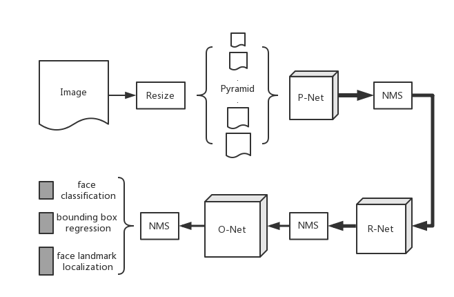

# MTMN

MTMN is a lightweight **Human Face Detection Model**, which is built around [a new mobile architecture called MobileNetV2](https://arxiv.org/abs/1801.04381) and [Multi-task Cascaded Convolutional Networks](https://arxiv.org/abs/1604.02878), and is specially designed for embedded devices.

## Overview

MTMN consists of three main parts:

1. Proposal Network (P-Net): Proposes candidate bounding boxes, and sends them to the R-Net;
2. Refine Network (R-Net): Screens the bounding boxes from P-Net;
3. Output Network (O-Net): Outputs the final results, i.e. the accurate bounding box, confidence coefficient and 5-point-landmark.

The following diagram shows the workflow of MTNM.



## API Introduction

```c
box_array_t *face_detect(dl_matrix3du_t *image_matrix, mtmn_config_t *config);
```

This `face_detect()` handles the whole face detection mission.

The inputs are:

- **image_matrix**: an image in `dl_matrix3du_t` type
- **config**: the configuration of MTMN. More details could be found in **Advance Configuration** section.

The output is:

- A `box_array_t` type value contains face boxes, as well as score and landmark of each box.

This structure is defined as follows:
```c
typedef struct tag_box_list
{
    fptp_t *score;
    box_t *box;
    landmark_t *landmark;
    int len;
} box_array_t;
```
The structure contains heads of arrays, each array has a same length, which is the number of faces in the image.

## Advance Configuration

`face_detect()` provides the `config` parameter for users' customized definition.

```c
box_array_t *face_detect(dl_matrix3du_t *image_matrix, mtmn_config_t *config);
```

The definition of `mtmn_config_t`:

```c
typedef struct
{
    float min_face;                 /// The minimum size of a detectable face
    float pyramid;                  /// The scale of the gradient scaling for the input images
    int pyramid_times;              /// The pyramid resizing times
    threshold_config_t p_threshold; /// The thresholds for P-Net. For details, see the definition of threshold_config_t
    threshold_config_t r_threshold; /// The thresholds for R-Net. For details, see the definition of threshold_config_t
    threshold_config_t o_threshold; /// The thresholds for O-Net. For details, see the definition of threshold_config_t
    mtmn_resize_type type;          /// The image resize type. 'pyramid' will lose efficacy, when 'type'==FAST.
} mtmn_config_t;
```

```c
typedef struct
{
    float score;          /// The threshold of confidence coefficient. The candidate bounding boxes with a confidence coefficient lower than the threshold will be filtered out.
    float nms;            /// The threshold of NMS. During the Non-Maximum Suppression, the candidate bounding boxes with a overlapping ratio higher than the threshold will be filtered out.
    int candidate_number; /// The maximum number of allowed candidate bounding boxes. Only the first 'candidate_number' of all the candidate bounding boxes will be kept.
} threshold_config_t;
```

- **min_face**: 
	- Range: [12, the length of the shortest edge of the original input image). 
	- For an original input image of a fixed size, the smaller the `min_face` is, 
		- the larger the number of generated images of different sizes is;
		- the smaller the minimum size of a detectable face is;
		- the longer the processing takes
	- and vice versa.
- **pyramid**
	- Specifies the scale that controls the generated pyramids. 
	- Range: (0,1)
	- For an original input image of a fixed size, the larger the `pyramid` is,
		- the larger the number of generated images of different sizes is;
		- the higher the detection ratio is;
		- the longer the processing takes
	- and vice versa.
- **pyramid_times**
  - Specifies the number that controls the generated pyramids.
  - Range: [1,+inf)
  - Together with **pyramid** and **min_face**, the main detectable face size could be determined at range [min_face, min_face/pyramid^pyramid_times] and min_face/pyramid^pyramid_times < the length of the shortest edge of the original input image.
- **type**
  - options: `FAST` or `NORMAL`
    - `FAST`: **pyramid** equals to `0.707106781` in default. At the same **pyramid** value, `FAST` type is faster than `NORMAL` type.
    - `NORMAL`: If you would like to customize **pyramid** value, set the type to `NORMAL` please.
- **score threshold**
	- Range: (0,1)
	- For an original input image of a fixed size, the larger the `score` is,
		- the larger the number of filtered out candidate bounding boxes is
		- the lower the detection ratio is
	- and vice versa.
- **nms threshold**
	- Range: (0,1)
	- For an original input image of a fixed size, the larger the `nms` is,
		- the higher the possibility that an overlapped face can be detected is;
		- the larger the number of detected candidate bounding boxes of a same face is
	- and vice versa.
- **candidate number**
	- Specifies the number of the output candidate boxes of each network. 
	- Range
		- P-Net: [1, 200]
		- R-Net: [1, 100]
		- O-Net: [1, 10]
	- For an original input image of a fixed size, 
		- the larger the `candidate_number` is, the longer the processing takes;
		- the larger the `candidate_number` of O-Net is, the larger number of detected faces is
	- and vice versa.

Users can configure these parameters based on their actual requirements. Please also see the recommended configuration for general-purpose scenarios(one face detection) below:

```c
mtmn_config.type = FAST;
mtmn_config.min_face = 80;
mtmn_config.pyramid = 0.707;
mtmn_config.pyramid_times = 4;
mtmn_config.p_threshold.score = 0.6;
mtmn_config.p_threshold.nms = 0.7;
mtmn_config.p_threshold.candidate_number = 20;
mtmn_config.r_threshold.score = 0.7;
mtmn_config.r_threshold.nms = 0.7;
mtmn_config.r_threshold.candidate_number = 10;
mtmn_config.o_threshold.score = 0.7;
mtmn_config.o_threshold.nms = 0.7;
mtmn_config.o_threshold.candidate_number = 1;
```

### Model Selection

Two versions of MTMN are available by now:

- MTMN lite in quantization (*default*)
- MTMN lite in float
- MTMN heavy in quantization

#### Performance

We evaluate all models with the same configuration and our own test set. The results are shown below.

```c
mtmn_config.type = FAST;
mtmn_config.pyramid = 0.707;
mtmn_config.min_face = 80;
mtmn_config.pyramid_times = 4;
mtmn_config.p_threshold.score = 0.6;
mtmn_config.p_threshold.nms = 0.7;
mtmn_config.p_threshold.candidate_number = 100;
mtmn_config.r_threshold.score = 0.7;
mtmn_config.r_threshold.nms = 0.7;
mtmn_config.r_threshold.candidate_number = 100;
mtmn_config.o_threshold.score = 0.7;
mtmn_config.o_threshold.nms = 0.7;
mtmn_config.o_threshold.candidate_number = 1;
```

|                            | Average Time Consumption (ms) |
| :------------------------: | :---------------------------: |
| MTMN lite in quantization  |            143.19             |
|     MTMN lite in float     |            178.45             |
| MTMN heavy in quantization |            242.84             |

#### How to select

Models can be selected through `idf.py menuconfig` or `make menuconfig`. Select <u>Component config</u> >> <u>ESP-FACE Configuration</u> >> <u>Detection Model</u> sequentially, you'll see options below.


 
