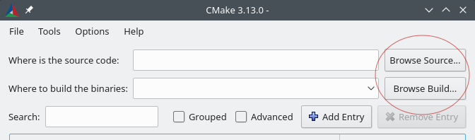
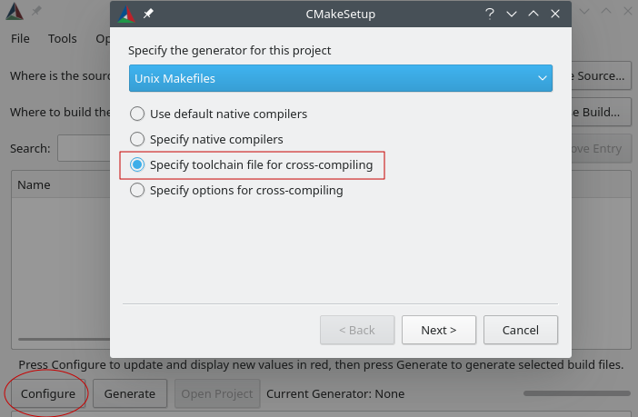
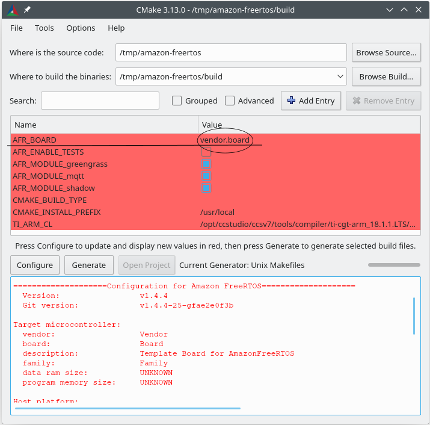

# CMake for FreeRTOS

## Prerequisites

### Host OS requirements

Generally any version of Windows, macOS and Linux are supported provided the compilation toolchain
of the target device is available on that OS.

**Note**: Windows subsystem for Linux (WSL) is not supported, please use native CMake on Windows.

### CMake

**CMake version 3.13 or higher is required**. You can download the binary distribution from
[CMake's official website](https://cmake.org/download/), or install with your OS package manager
e.g., homebrew on macOS and [scoop](https://scoop.sh/) or [chocolatey](https://chocolatey.org/) on
Windows. Note that the CMake package provided in many Linux distributions' package managers are out
of date most of time, you can choose another package manager like [linuxbrew](http://linuxbrew.sh/)
or [nix](https://nixos.org/nix/) in this case. If you download the binary distribution, you also
need to add the CMake executable to the `PATH` environment variable if you want to use it from
command line.

### Native build system

CMake can target many native build systems. Generally you can choose either [GNU Make](
https://www.gnu.org/software/make) or [Ninja](https://github.com/ninja-build/ninja/releases). Both
of them can be installed via package managers on Linux, macOS and Windows. Ninja is preferred when
compiler is supported, it is faster than Make and also natively support all desktop OS. For using
Make on Windows, you can install a standalone version from [Equation](
http://www.equation.com/servlet/equation.cmd?fa=make), or install [MinGW](
https://sourceforge.net/projects/mingw-w64/files) which bundles make.

**Note**: The Make executable in MinGW is called `mingw32-make.exe` instead of `make.exe`.

## Building instructions

Basically there are 2 steps to build any CMake based project,

1. Run CMake to generate build files for a native build system, e.g., Make or Ninja.
1. Invoke the native build system to build the project.

By default, CMake targets your host OS. To use it for cross compiling, you need to set
`CMAKE_TOOLCHAIN_FILE` before CMake reads your top level `CMakeLists.txt` file (usually from
commandline). This "toolchain file" specifies which compiler to use and set some CMake variables
like system name and default search path. For more details of cross compiling with CMake, check
the [official wiki](https://gitlab.kitware.com/cmake/community/wikis/doc/cmake/CrossCompiling).

### Generate build files

To run CMake for FreeRTOS, you need to specify 2 things,

1. Target MCU, e.g., TI's CC3220SF LaunchPad.
1. Compiler to use, e.g., GCC for ARM. Note that you need to make sure it's either in `PATH`
   environment variable or let CMake know where to find it.

CMake comes with a [command-line tool](https://cmake.org/cmake/help/latest/manual/cmake.1.html) and
an [interactive GUI tool](https://cmake.org/cmake/help/latest/manual/cmake-gui.1.html). You can use
any of them.

#### Commandline instructions
By default demos are compiled. You can however select test by adding the command
'-DAFR_ENABLE_TESTS=1'

You can use `VENDOR` and `BOARD` to specify which MCU you are targeting, and `COMPILER` to tell
which compiler you want to use. The values of `VENDOR` and `BOARD` must match the folder names under
`cmake/vendors`. And the value of `COMPILER` must match the file names under `cmake/toolchains`,
`CMAKE_TOOLCHAIN_FILE` will be set to this file. For example, issue the following command from the
root directory **(requires TI compiler in `PATH`)**,

```sh
# `-S` and `-B` options tell CMake where our source code is and where to
# put the generated build files.
cmake -DVENDOR=ti -DBOARD=cc3220_launchpad -DCOMPILER=arm-ti -S. -Bbuild

# If you're on Windows, also add -G"Unix Makefiles" or -GNinja because
# CMake will use Visual Studio as the default generator on Windows.
cmake -DVENDOR=ti -DBOARD=cc3220_launchpad -DCOMPILER=arm-ti -S. -Bbuild -GNinja
```

Note that you don't have to use full names for `VENDOR` and `BOARD`, partial names are also OK
provided there is only a single match. We use regular expression `${VENDOR}.*` and `${BOARD}.*` to
search for a matching board. For example,

```sh
cmake -DVENDOR=ti -DCOMPILER=arm-ti -S. -Bbuild
cmake -DBOARD=cc3220 -DCOMPILER=arm-ti -S. -Bbuild
cmake -DVENDOR=t -DBOARD=cc -DCOMPILER=arm-ti -S. -Bbuild
```

You can also set `CMAKE_TOOLCHAIN_FILE` directly if you want to use a custom file from a
different location instead of the default `cmake/toolchains`, for example,

```sh
cmake -DBOARD=cc3220 -DCMAKE_TOOLCHAIN_FILE='/path/to/toolchain_file.cmake' -S. -Bbuild
```

Additionally, if the toolchain file does not use absolute path for your compiler, and you didn't
add your compiler to the PATH environment variable, CMake may not be able to find it. In this case,
you can use `AFR_TOOLCHAIN_PATH` to provide a search path. We will search the directory and its
`bin` sub-folder,

```sh
cmake -DVENDOR=ti -DBOARD=cc3220 -DCOMPILER=arm-ti \
-DAFR_TOOLCHAIN_PATH=/Applications/ti/ti-cgt-arm_18.1.3.LTS -S. -Bbuild
```

To enable debugging, you need to set `CMAKE_BUILD_TYPE` to `debug`, CMake will then add debug flags
to the compile options. This will build FreeRTOS with debug symbols. You can also set
`CMAKE_BUILD_TYPE` to `release`, CMake will then add optimization flags to the compile options.

```sh
# Build with debug symbols
cmake -DBOARD=cc3220 -DCOMPILER=arm-ti -DCMAKE_BUILD_TYPE=debug -S. -Bbuild
```

#### GUI instructions

Start `cmake-gui`, specify source code and output binaries locations:



Click **Configure** and choose **Specify toolchain file for cross-compiling**. Optionally, select a
build system from the **Specify the build generator for this project**
dropdown list.



Click next, then choose the toolchain file, e.g. `<AFR_ROOT>/cmake/toolchains/arm-ti.cmake`, and
click **Finish**. You will see a pop up window that says "Error in configuration process". This is
because we default to the template board, which doesn't provide any portable layer target. Now you
should see a window that looks like this:



From the dropdown box of `AFR_BOARD`, select your board and click **Configure** again. Then click
the **Generate** button. After it's finished, you should see the generated native build system files
in the output binaries directory.

### Build FreeRTOS

To build FreeRTOS, simply call the native build system command from the output binaries
directory. Note that each FreeRTOS module will be built separately and output a static
library.

```sh
cd build
make -j4
```

Alternatively, you can let CMake call the native build system for you,

```sh
cmake --build <build_dir>
```

CMake provides an abstraction layer for calling native build systems, some common usages are,

```sh
# Take advantage of CPU cores.
cmake --build <build_dir> --parallel 8
# Build specific targets.
cmake --build <build_dir> --target afr_kernel
# Clean first, then build.
cmake --build <build_dir> --clean-first
```

Check the CMake official document to see more information about the [build tool mode](
https://cmake.org/cmake/help/latest/manual/cmake.1.html#build-tool-mode).

## Porting Guide

To add CMake support for a new hardware, see the document [here](doc/porting_guide.md).
