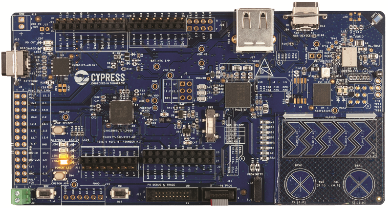

# CY8CKIT-062-WIFI-BT BSP

## Overview

The PSoC 6 WiFi-BT Pioneer Kit is a low-cost hardware platform that enables design and debug of the PSoC 62 MCU (CY8C6247BZI-D54) and the Murata LBEE5KL1DX Module (CYW4343W WiFi + Bluetooth Combo Chip).

To use code from the BSP, simply include a reference to `cybsp.h`.

## Features

### Kit Features:

* BLE v5.0
* Serial memory interface
* PDM-PCM digital microphone interface
* Industry-leading CapSense
* Full-speed USB
* IEEE 802.11a/b/g/n WLAN

### Kit Contents:

* CY8CKIT-062-WIFI-BT evaluation board
* TFT display shield with a 2.4" TFT display, light sensor, 6-axis motion sensor, and digital microphone
* USB cable

## BSP Configuration

### Clock Configuration

| Clock    | Source    | Output Frequency |
|----------|-----------|------------------|
| CLK_HF0  | CLK_PATH0 | 100 MHz          |
| CLK_HF1  | CLK_PATH1 | 48 MHz           |
| CLK_HF2  | CLK_PATH0 | 50 MHz           |
| CLK_HF3  | CLK_PATH1 | 48 MHz           |

### Power Configuration

* System Active Power Mode: LP
* System Idle Power Mode: Deep Sleep
* VDDA Voltage: 3300 mV
* VDDD Voltage: 3300 mV

## API Reference Manual

The CY8CKIT-062-WIFI-BT Board Support Package provides a set of APIs to configure, initialize and use the board resources.

See the [BSP API Reference Manual][api] for the complete list of the provided interfaces.

## More information
* [CY8CKIT-062-WIFI-BT BSP API Reference Manual][api]
* [CY8CKIT-062-WIFI-BT Documentation](http://www.cypress.com/documentation/development-kitsboards/psoc-6-wifi-bt-pioneer-kit)
* [Cypress Semiconductor](http://www.cypress.com)

[api]: https://cypresssemiconductorco.github.io/TARGET_CY8CKIT-062-WIFI-BT/html/modules.html

---
© Cypress Semiconductor Corporation, 2019.