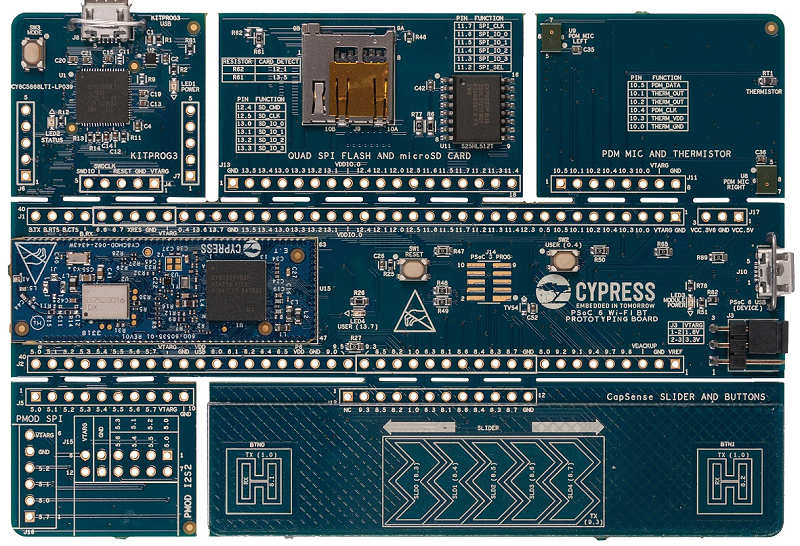

# CY8CPROTO-062-4343W BSP

## Overview

The CY8CPROTO-062-4343W PSoC 6 Wi-Fi BT Prototyping Kit is a low-cost hardware platform that enables design and debug of PSoC 6 MCUs. It comes with a Murata LBEE5KL1DX module, based on the CYW4343W combo device, industry-leading CapSense for touch buttons and slider, on-board debugger/programmer with KitProg3, microSD card interface, 512-Mb Quad-SPI NOR flash, PDM-PCM microphone, and a thermistor. This kit is designed with a snap-away form-factor, allowing the user to separate the different components and features that come with this kit and use independently. In addition, support for Digilent's Pmod interface is also provided with this kit.

To use code from the BSP, simply include a reference to `cybsp.h`.

## Features

### Kit Features:

* Support of up to 2MB Flash and 1MB SRAM
* Dedicated SDHC to interface with WICED wireless devices.
* Delivers dual-cores, with a 150-MHz Arm Cortex-M4 as the primary application processor and a 100-MHz Arm Cortex-M0+ as the secondary processor for low-power operations.
* Supports Full-Speed USB, capacitive-sensing with CapSense, a PDM-PCM digital microphone interface, a Quad-SPI interface, 13 serial communication blocks, 7 programmable analog blocks, and 56 programmable digital blocks.

### Kit Contents:

* PSoC 6 Wi-Fi BT Prototyping Board
* USB Type-A to Micro-B cable
* Quick Start Guide

## BSP Configuration

### Clock Configuration

| Clock    | Source    | Output Frequency |
|----------|-----------|------------------|
| CLK_HF0  | CLK_PATH0 | 100 MHz          |
| CLK_HF2  | CLK_PATH0 | 50 MHz           |
| CLK_HF3  | CLK_PATH2 | 48 MHz           |
| CLK_HF4  | CLK_PATH0 | 100 MHz          |

### Power Configuration

* System Active Power Mode: LP
* System Idle Power Mode: Deep Sleep
* VDDA Voltage: 3300 mV
* VDDD Voltage: 3300 mV

## API Reference Manual

The CY8CPROTO-062-4343W Board Support Package provides a set of APIs to configure, initialize and use the board resources.

See the [BSP API Reference Manual][api] for the complete list of the provided interfaces.

## More information
* [CY8CPROTO-062-4343W BSP API Reference Manual][api]
* [CY8CPROTO-062-4343W Documentation](http://www.cypress.com/CY8CPROTO-062-4343W)
* [Cypress Semiconductor](http://www.cypress.com)

[api]: https://cypresssemiconductorco.github.io/TARGET_CY8CPROTO-062-4343W/html/modules.html

---
© Cypress Semiconductor Corporation, 2019.